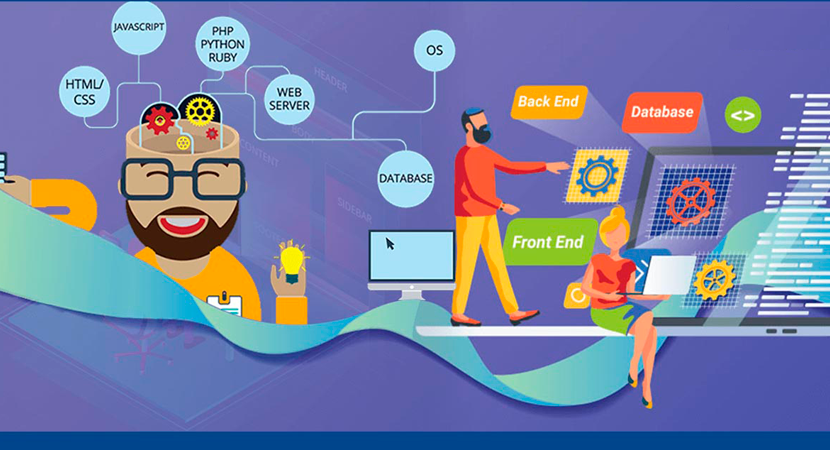
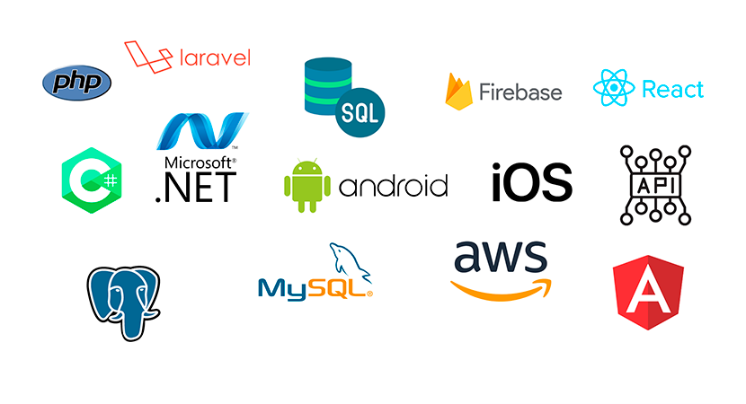

<!-- Your banner image -->

<!-- Your introduction -->

# Hi there! 👋 I'm Bryan Colorado

I'm a passionate software engineer specializing in web and mobile application development. I love turning ideas into
functional and user-friendly solutions. Let's build something amazing together!

<!-- Your skills -->

## Skills and Technologies

<!-- Your featured projects -->

## Featured Projects

### 🚀[Random video chat Mobile Application](https://play.google.com/store/apps/details?id=com.pum.chat.app)

I developed an Android application using Java. The application allows users to make random video calls with people from
anywhere in the world.

### 📱 [Taxis Mobile Application](https://www.mevoy.com.co/conduce/)

I developed an Android and IOS application using Java and Swift. The application allows users to find cabs and cab
drivers to find passengers.

### 🚀 [Income tax return](https://coldeclara.com/)

I developed an backend using Laravel. Rhe application allows users to send pertinent information to an accountant to
generate their income tax return.

### 📱 [Customizable online multi-store](https://flashcookie.com/)

I developed an backend using Laravel. The application allows users to upload their designs and mount them on certain
products, creating an online store.

<!-- Your contact and collaboration -->

## Collaboration and Contact

  

  Let's connect and create something awesome together!

<!-- Your footer -->
<!-- Add any additional badges, social media links, or other relevant information here -->